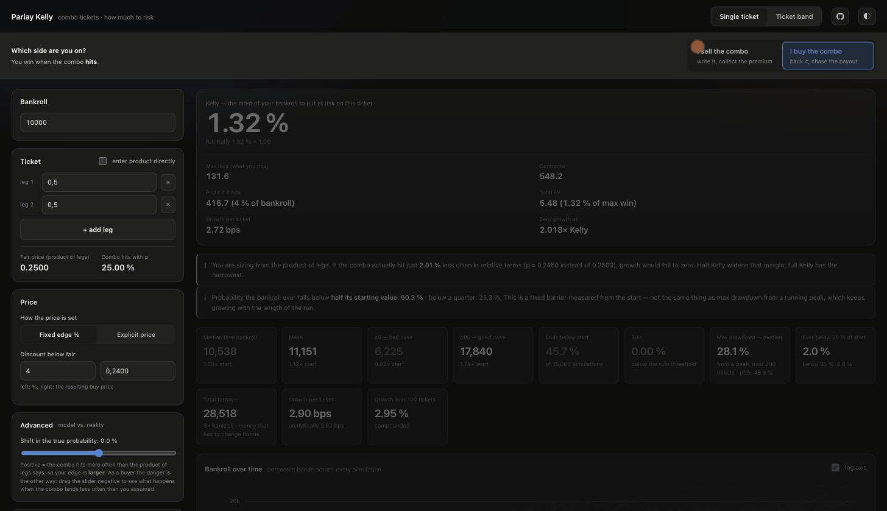
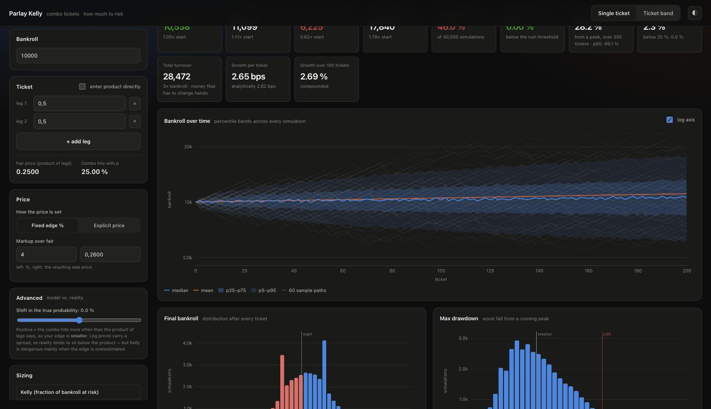

<div align="center">

# Parlay Kelly

**How much of your bankroll to put on a combo ticket — whether you are buying it or writing it.**

[Live demo](https://kelly.polylab.app/) &nbsp;·&nbsp; [Quickstart](#quickstart) &nbsp;·&nbsp; [The maths](#the-maths) &nbsp;·&nbsp; [Limits](#limits-and-assumptions)

[](LICENSE)   



</div>

A parlay pays out only if every leg lands, so its fair price is the product of
the leg prices. That much is easy. The hard question is the next one: given an
edge over that fair price, how much money should actually go on the ticket, and
what does betting that much do to your bankroll over a few hundred tickets?

This answers both. It computes the Kelly fraction analytically, then runs a
Monte Carlo simulation so you can see the distribution behind the number — the
drawdowns, the tail, and how fast it all falls apart when the edge is not quite
what you thought.

No dependencies. Python stdlib to serve it, a browser for the rest.

## Pick a side first

The one control that governs everything else is at the top: **are you selling
the combo or buying it?**

|  | You win when | You risk | You collect |
|---|---|---|---|
| **Sell** — you write the ticket | the combo **misses** | `1 − c` per contract | `c` per contract |
| **Buy** — you back the ticket | the combo **hits** | `c` per contract | `1 − c` per contract |

> [!IMPORTANT]
> The two sides are mirror images for a single bet, but they are **not**
> interchangeable across a range of tickets — see [the asymmetry](#the-asymmetry-that-surprised-me).
> Every label, formula and chart follows the side you pick, and results computed
> for one side are dimmed the moment you switch, so stale numbers can never be
> mistaken for current ones.

## Quickstart

```bash
git clone https://github.com/frla18cz/parlay-kelly.git
cd parlay-kelly
python3 serve.py            # http://localhost:8090
```

Or build the single-file version and open it by double-clicking:

```bash
python3 build.py            # → dist/parlay-kelly.html
```

That file makes no external requests at all — it works from `file://`, over
email, or dropped onto any static host.

## What it shows

**Single ticket** — enter the legs, choose your edge, get the Kelly fraction,
contract count, EV and expected growth. Then simulate: percentile bands over
time, the final-bankroll distribution, max drawdown, a per-ticket trade log you
can export, and a sensitivity curve for what happens when your probability
estimate is wrong.

**Ticket band** — instead of one ticket, a whole range of them drawn at random,
which is closer to what a real book of business looks like. Shows how growth
varies across the range and what edge each part of it needs to pull its weight.



## The maths

One contract, payout 1.00 if the combo hits. `p` is the true probability, `c`
the price. From your seat, whichever side you are on:

| | |
|---|---|
| fair price | `p = Π aᵢ` (product of leg prices) |
| you win | `gain` with probability `winProb` |
| you lose | `risk` with probability `1 − winProb` |
| odds | `b = gain / risk` |
| **Kelly** | `f* = (b·winProb − lossProb) / b` |
| growth per ticket | `g(f) = winProb·ln(1 + f·b) + lossProb·ln(1 − f)` |

where selling gives `gain = c`, `risk = 1 − c`, `winProb = 1 − p`, and buying
gives `gain = 1 − c`, `risk = c`, `winProb = p`.

`f*` is the **fraction of bankroll at risk** — maximum loss divided by bankroll.
With an asymmetric payout that is the only unambiguous definition: "fraction of
stake" and "fraction of exposure" stop agreeing the moment a win and a loss move
different amounts of money.

### Three results the app is built around

**1. Selling at a fixed percentage markup makes Kelly a constant.** Sell at
`c = p(1+m)` and `f* = m/(1+m)`, independent of `p`. At 4 % it is 3.85 % of
bankroll whether the ticket prices at 0.10 or at 0.50.

**2. Growth per ticket is not constant.** At the same capital at risk:

| your win prob | 0.5 | 0.6 | 0.7 | 0.8 | 0.9 |
|---|---|---|---|---|---|
| growth / ticket | 8.01 bps | 5.29 bps | 3.38 bps | 1.96 bps | 0.87 bps |
| markup for equal growth | 4.0 % | 4.9 % | 6.2 % | 8.2 % | **12.4 %** |

A balanced ticket earns **9.2×** the log growth of a deeply lopsided one while
tying up exactly the same capital. Growth is shown in basis points throughout
(1 bps = 0.01 %) because `E[log]` lands around `1e-4` and reads terribly in
exponential notation.

**3. Full Kelly tolerates about 2 % relative error in `p`** before growth hits
zero — half Kelly about 3 %, quarter Kelly about 3.5 %. Hence the sensitivity
chart, and hence the fact that fractional Kelly is the default advice everywhere.

### The asymmetry that surprised me

Buying is *not* the mirror image of selling once you look at a range of tickets.
At a fixed discount `d`, a buyer's Kelly fraction is

```
f* = p·d / (1 − p(1−d))
```

which **moves with `p`** instead of staying put. Over a band of tickets from
`p = 0.5` to `p = 0.9` at a 4 % edge, a seller sizes every ticket at 3.85 %,
while a buyer's optimal size runs from 3.85 % all the way to 26.5 %. The
consequence flips too: selling earns most on balanced tickets, buying earns most
on the long shots.

The app states which end of the band is winning rather than assuming, because
getting this backwards is an expensive mistake and it is not obvious from
either side.

<details>
<summary><b>Two different measures of decline — and why they are not interchangeable</b></summary>

<br>

- **Max drawdown from a running peak** grows without bound as the series gets
  longer. It is the maximum of a reflected walk, which returns to zero infinitely
  often, so a longer horizon always finds a deeper hole. At full Kelly across a
  band: 56 % / 87 % / 98 % over 1k / 10k / 100k tickets. Always ask "over how
  many tickets".
- **Ever below X % of the starting bankroll** is a fixed barrier and converges
  with the horizon. `P ≈ x^s` where `s = 2g/var(log)`. Verified: 50.5 % against
  a theoretical 49.8 % at full Kelly over 100k tickets (and 25.7 % vs 24.9 % at
  quarter Kelly).

`kelly.js` → `drawdownProb()` computes the second. The first can only be simulated.

Both are shown in the app, side by side, precisely because quoting one while
meaning the other is such a common way to be wrong about risk.

</details>

<details>
<summary><b>Concurrent tickets — when splitting Kelly is right, and when it quietly costs you</b></summary>

<br>

For **independent** tickets, concurrency does not matter: ten at once behaves
like ten in a row. The optimal fraction per ticket barely moves (3.846 % at one,
3.806 % at twenty) and growth and drawdown come out the same — within a round,
losses partially cancel instead of compounding.

Splitting Kelly between independent concurrent tickets is therefore
**underbetting**: you keep `2/k − 1/k²` of the growth, so 75 % at two, 36 % at
five, 19 % at ten. (Quadratic approximation; within 0.1 % of Monte Carlo.)

Splitting is right only when tickets are **correlated** — when they share legs.
Then exposure adds up and it is like betting `k×` Kelly on one bet: two perfectly
correlated tickets already drive growth to zero, five give a 75 % chance of ruin.

The textbook "2× Kelly = zero growth" holds exactly only for a symmetric bet
(`winProb = 0.5`); with a skewed payout the point sits lower (~1.977× at
`winProb = 0.9`), so it is solved numerically rather than hardcoded.

</details>

## The engine

Seeded mulberry32, fully reproducible. Runs in batches on the main thread — 100M
steps in a few seconds, and chunked execution behaves identically over `http://`,
`file://`, and inside a strict-CSP host where a blob worker could fail outright.

Memory is O(1) in the number of simulations: percentile bands come from a
log-grid histogram (121 checkpoints × 2400 bins), and only the arrays of final
bankrolls and max drawdowns, plus 200 sample paths, are kept exactly.

<details>
<summary><b>Verification — what was actually checked, and against what</b></summary>

<br>

- **Golden test** — legs 0.5/0.5, 4 % markup: `c = 0.26`, `f* = 3.846 %`,
  EV 0.01/contract; at a bankroll of 10,000 → max loss 384.62, 519.75 contracts,
  premium 135.14.
- **Both sides** — the buy-side Kelly matches the closed form `p·d/(1−p(1−d))`
  exactly; `edgeFromPrice` inverts `priceFromEdge` on both sides; the edge
  tolerance comes out positive for a seller and negative for a buyer, as it must.
- **Convergence** — the median final bankroll tracks `B₀·e^(g·T)`, and the Monte
  Carlo estimate of `E[log]` approaches the analytic `g` as N grows (−0.84 % at
  60k simulations, −0.13 % at 600k).
- **Band mode** — the Monte Carlo average matches the analytic average across
  the band to within 0.1 %, on both sides.
- **Band accuracy** — a percentile from the histogram differs from the exact
  value by 0.07 %.
- **Reproducibility** — the same seed gives a bit-for-bit identical result, and
  the replayed trade log reproduces its simulation's final bankroll exactly.

</details>

## Limits and assumptions

> [!WARNING]
> This is a sizing and risk-visualisation tool. It is not betting advice, and it
> has no way of knowing whether your edge is real.

- **Legs are assumed independent.** The fair price is a plain product. Correlated
  legs (same match, same player, same weather) make the true probability higher
  than the product, which eats a seller's edge directly. Use the probability
  shift slider to see what that costs you.
- **Prices are entered by hand.** Nothing is fetched from any exchange or book.
- **One price, no book.** There is no order book, no partial fills, no slippage,
  no fees. Real trading has all four.
- **No bankroll constraints beyond the cap.** Margin, collateral and position
  limits are not modelled.
- **The probability estimate is yours.** Everything downstream is only as good
  as `p`, and result 3 above is about exactly how unforgiving that is.

## Layout

```
src/index.html      markup
src/styles.css      design system, dark/light
src/js/kelly.js     analytics (Kelly, growth, drawdown, risk of ruin)
src/js/sim.js       Monte Carlo engine
src/js/charts.js    canvas charting layer
src/js/app.js       state and wiring
build.py            inliner → single file
serve.py            static server
docs/               what the two hosts serve (built page + images)
vercel.json         static deploy config
```

## Hosting

The live demo runs on Vercel at **<https://kelly.polylab.app>**, deployed from
`docs/` as a static site — there is no server, no build step on the host, and
nothing to configure beyond `vercel.json`.

The same `docs/` folder is also published through GitHub Pages at
<https://frla18cz.github.io/parlay-kelly/>, which stays up as a mirror so older
links keep working. Both addresses serve the identical single-file page, so
either one is safe to share.

## Licence

MIT — see [LICENSE](LICENSE).

> [!NOTE]
> Shared as-is, because it was useful to me and might be useful to you. I am not
> committing to maintain it, review pull requests, or answer issues. Fork it
> freely if you want it to go somewhere I am not taking it.
